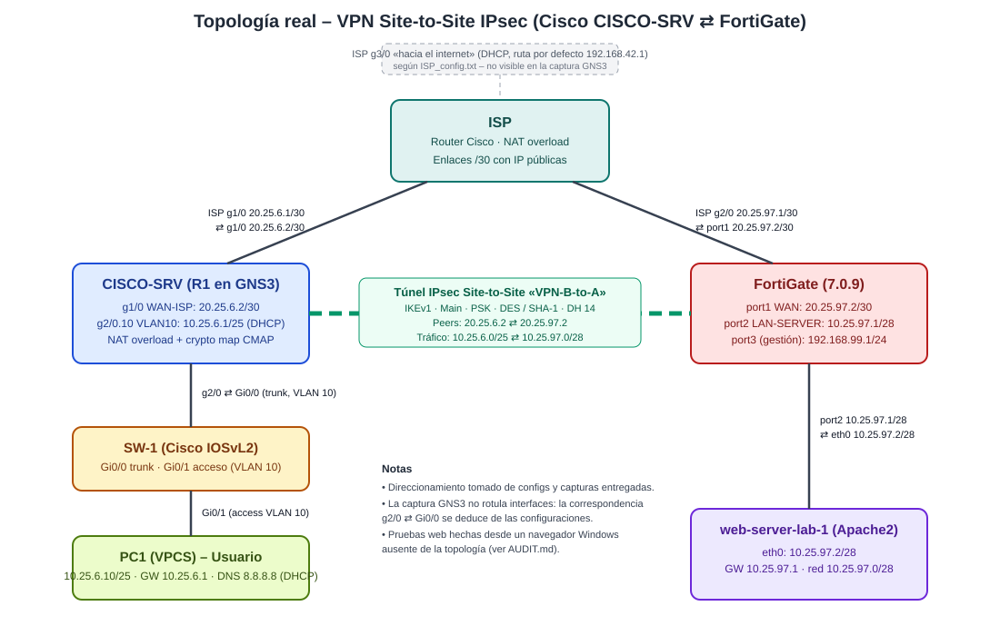
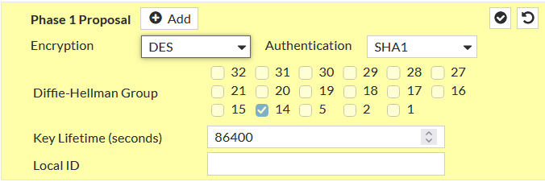
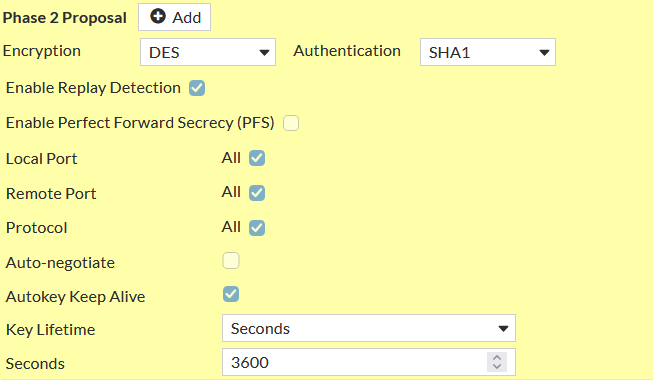
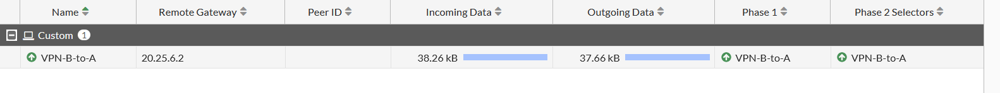
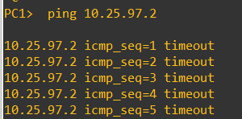
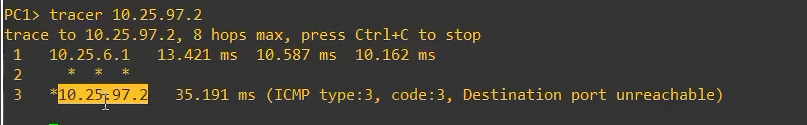

# VPN Site-to-Site Lab: FortiGate ⇄ Cisco (IPsec)

> ## 🎥 Video demostrativo
> **PENDIENTE: video no entregado (NOT EVIDENCED).** Este espacio está reservado al inicio del README, como exige el requisito. Instrucciones en [`videos/LEEME.md`](videos/LEEME.md) y [`docs/09-publicar-en-github.md`](docs/09-publicar-en-github.md).

## Propósito del laboratorio (Infraestructura 2)
- Comunicar el **Usuario** con el **Servidor** a través del enlace VPN.
- Comprobar que la comunicación **solo fluye si el enlace VPN está activo**.

Requisitos del enunciado:

| Componente | Requisito |
|---|---|
| FortiGate | Toda configuración y demostración por GUI: red, NAT, VPN Site-to-Site |
| Equipo de red (Cisco) | Red, NAT, VPN Site-to-Site |
| ISP | IP públicas |
| Servidor web | Red /28, Web Server HTTPS |
| Usuarios | Red /25, VLAN 10, DHCP, traceroute hacia el servidor |

Implementación realizada por Emely Carrasco (2025-0697). Todo se basa en sus configuraciones y capturas; lo que falta aparece como `NOT EVIDENCED` o `PARTIAL`.

## Topología

Captura original de GNS3: [`evidence/topologia/01_topologia_gns3_original.png`](evidence/topologia/01_topologia_gns3_original.png)

## Dispositivos y direccionamiento
| Dispositivo | Interfaz | IP | Función |
|---|---|---|---|
| ISP | g1/0 · g2/0 | 20.25.6.1/30 · 20.25.97.1/30 | Interconexión pública + NAT |
| CISCO-SRV (R1) | g1/0 · g2/0.10 | 20.25.6.2/30 · 10.25.6.1/25 | WAN/VPN, VLAN 10, DHCP, NAT |
| SW-1 | Gi0/0 · Gi0/1 | trunk · acceso VLAN 10 | Switch de Usuarios |
| PC1 (VPCS) | – | 10.25.6.10/25 (DHCP) | Usuario |
| FortiGate | port1 · port2 | 20.25.97.2/30 · 10.25.97.1/28 | WAN/VPN, firewall |
| web-server-lab-1 | eth0 | 10.25.97.2/28 | Servidor Apache2 |

Tabla completa: [docs/01-direccionamiento.md](docs/01-direccionamiento.md)

## VPN
IKEv1 (Main, PSK), peers 20.25.6.2 ⇄ 20.25.97.2, tráfico protegido 10.25.6.0/25 ⇄ 10.25.97.0/28. Las propuestas coinciden en ambos extremos:

| Fase 1 (DES/SHA1, DH 14, 86400 s) | Fase 2 (DES/SHA1, sin PFS, 3600 s) |
|---|---|
|  |  |

Detalle: [docs/05-vpn-ipsec.md](docs/05-vpn-ipsec.md)

## Resultados: VPN activa vs VPN inactiva
| VPN ACTIVA | VPN INACTIVA |
|---|---|
|  |  |
|  |  |
| Ping 5/5, Fase 1 ↑ / Fase 2 ↑, tráfico ESP ([Wireshark](evidence/vpn-activa/03_wireshark_trafico_ESP_cifrado.png)) | Ping 5/5 timeout, Fase 1 ↑ / Fase 2 ↓ |

Traceroute de PC1 hacia el servidor (VPN activa): 

Análisis completo: [docs/07-vpn-activa-vs-inactiva.md](docs/07-vpn-activa-vs-inactiva.md)

## Estado de los requisitos
| Estado | Requisitos |
|---|---|
| PASS | Red FortiGate · VPN FortiGate (Fase 1 y 2) · FortiGate por GUI · Red y VPN Cisco · ISP · Web Server /28 · Usuarios VLAN 10/DHCP · Comunicación con VPN activa · Traceroute · Imágenes · Diagramas · Documentación |
| PARTIAL | NAT (ambos equipos) · HTTPS · VPN inactiva · Running-configs · Scripts |
| NOT EVIDENCED | **Video** |

Matriz detallada y requisitos del repositorio: [docs/08-matriz-cumplimiento.md](docs/08-matriz-cumplimiento.md) · Revisión crítica: [AUDIT.md](AUDIT.md)

## Estructura
| Carpeta | Contenido |
|---|---|
| [`docs/`](docs/) | Documentación técnica por componente, comparativa, matriz y guía de publicación |
| [`diagrams/`](diagrams/) | Diagrama de red SVG |
| [`evidence/`](evidence/INDEX.md) | Capturas por categoría + índice con SHA-256 |
| [`configs/`](configs/) | Configuraciones originales sin modificar |
| [`scripts/`](scripts/README.md) | Nota sobre scripts |
| [`tests/`](tests/registro-de-pruebas.md) | Registro de pruebas |
| [`videos/`](videos/LEEME.md) | Video demostrativo (pendiente) |

## Documentación
[Direccionamiento](docs/01-direccionamiento.md) · [ISP](docs/02-isp.md) · [Cisco/VLAN 10/DHCP](docs/03-cisco-usuarios-vlan10-dhcp.md) · [FortiGate](docs/04-fortigate.md) · [VPN IPsec](docs/05-vpn-ipsec.md) · [Web Server](docs/06-web-server.md) · [Activa vs inactiva](docs/07-vpn-activa-vs-inactiva.md) · [Matriz](docs/08-matriz-cumplimiento.md) · [Publicar en GitHub](docs/09-publicar-en-github.md)

> ⚠️ Los configs contienen contraseñas y la PSK en texto plano. Revíselos antes de hacer público el repositorio.
