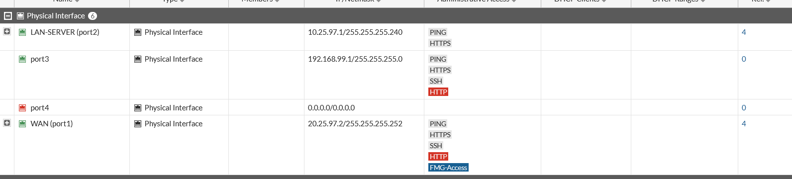
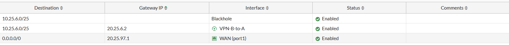

# FortiGate (FortiGate 7.0.9 en GNS3)

**Qué se configuró.** Interfaces, objetos de dirección, rutas estáticas, políticas de firewall (con NAT solo hacia Internet) y el túnel IPsec.
**Para qué sirve.** Es el extremo de la sede del servidor: protege la red 10.25.97.0/28 y termina la VPN con CISCO-SRV.

## Interfaces

WAN(port1) 20.25.97.2/30, LAN-SERVER(port2) 10.25.97.1/28, port3 192.168.99.1/24 (gestión), port4 sin IP. La captura aparece recortada: el encabezado indica 6 interfaces físicas y solo se ven 4.

## Objetos de dirección
| Objeto | Valor | Captura |
|---|---|---|
| `SERVER-NET` | 10.25.97.0 255.255.255.240 | [ver](../evidence/fortigate/04_objeto_direccion_SERVER-NET.png) |
| `USERS.NET` | 10.25.6.0 255.255.255.128 | [ver](../evidence/fortigate/05_objeto_direccion_USERS.NET.png) |

## Rutas estáticas

| Destino | Gateway | Interfaz |
|---|---|---|
| 10.25.6.0/25 | – | Blackhole |
| 10.25.6.0/25 | 20.25.6.2 | VPN-B-to-A |
| 0.0.0.0/0 | 20.25.97.1 | WAN (port1) |

## Políticas de firewall

| Política | Origen → Destino | NAT | Bytes |
|---|---|---|---|
| LAN-to-VPN | LAN-SERVER → VPN-B-to-A (SERVER-NET → USERS.NET) | Disabled | 0 B |
| VPN-to-LAN | VPN-B-to-A → LAN-SERVER (USERS.NET → SERVER-NET) | Disabled | 46.57 kB |
| LAN-to-WAN | LAN-SERVER → WAN (all → all) | **Enabled** | 0 B |
| Implicit Deny | any → any | – | – |

**Resultado.** Red y VPN: **PASS**. NAT: **PARTIAL** (NAT habilitado en la política de salida, pero sin tráfico registrado, 0 B). Todas las evidencias del FortiGate son de la GUI, como exige el enunciado. No se entregó la configuración CLI (`show full-configuration`) del FortiGate.
