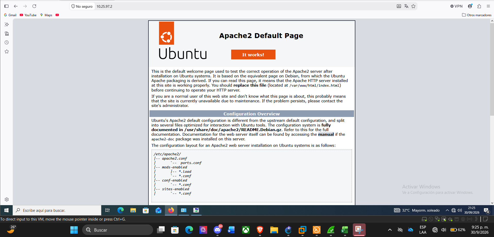

# Web Server (HTTPS) – red /28

**Qué se configuró.** Servidor Ubuntu con Apache2 en 10.25.97.2/28, gateway 10.25.97.1 (FortiGate port2).
**Evidencia de configuración.** [web-server_config.txt](../configs/web-server/web-server_config.txt):
`ip addr add 10.25.97.2/28 dev eth0` y `ip route add default via 10.25.97.1`. El mismo archivo incluye un comando `diagnose sniffer ... 'host 10.25.5.13 and port 443'` (ver AUDIT).

## Pruebas desde el navegador
| Captura | Qué muestra |
|---|---|
| [Prueba 1](../evidence/web-server/01_prueba_1_navegador_apache_10.25.97.2.png) | Navegador (Windows, 30/09/2026 21:25) en `10.25.97.2`, marcado «No seguro», con la página «Apache2 Default Page – It works!» |
| [Prueba 2](../evidence/web-server/02_prueba_2_navegador_barra_https.png) | Barra de direcciones con `https://10.25.97.2/` escrito y desplegable de sugerencias sobre la misma página Apache |

**Resultado.** Direccionamiento /28 y respuesta web del servidor: **PASS**. **HTTPS: PARTIAL.** Ninguna captura muestra certificado, candado/aviso TLS ni una carga confirmada con esquema `https://`; tampoco el estado de la VPN al momento de las capturas. Detalles en [AUDIT.md](../AUDIT.md).
