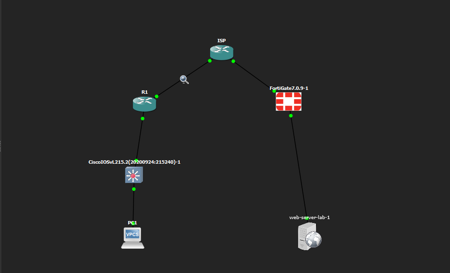
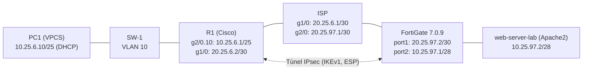
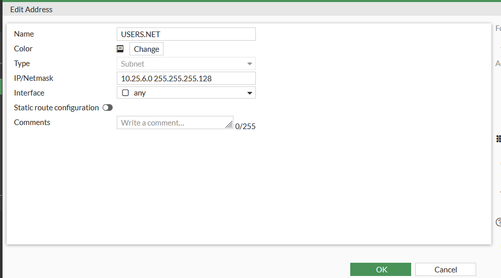
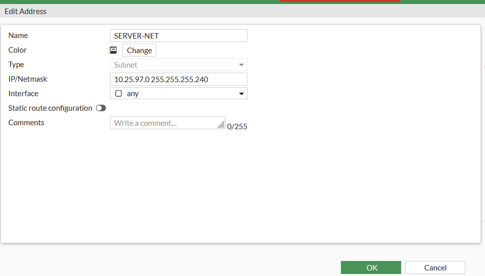
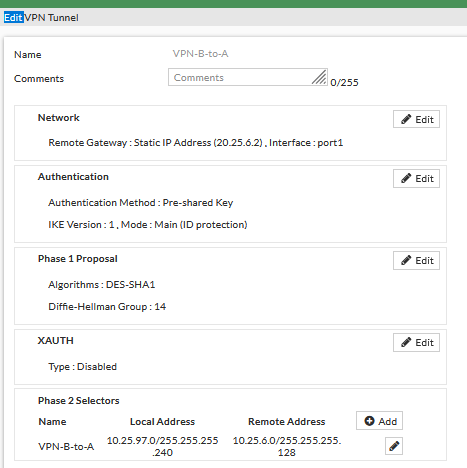
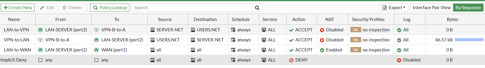
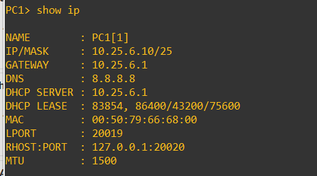
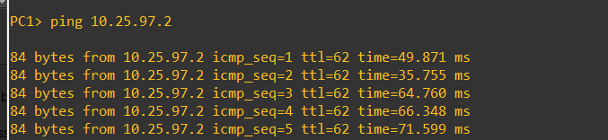
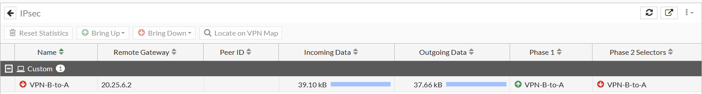

# VPN IPsec Site-to-Site entre Cisco IOS y FortiGate

Laboratorio en GNS3 que interconecta una red de usuarios (router Cisco) con una red de servidores protegida por un FortiGate mediante un túnel IPsec a través de un ISP simulado.

## 🎥 Video demostrativo

[](ENLACE_DEL_VIDEO)

> Enlace: **[ENLACE DEL VIDEO]**

## Objetivos
- Implementar un túnel VPN IPsec (IKEv1, modo túnel) entre un router Cisco IOS y un FortiGate.
- Proveer a los usuarios (VLAN 10) direccionamiento por DHCP y acceso seguro al servidor web.
- Excluir el tráfico VPN del NAT en el router.
- Demostrar que el tráfico entre sedes viaja cifrado (ESP) y que, sin VPN, no hay conectividad.

## Tecnologías y equipos
| Componente | Detalle |
|---|---|
| Simulador | GNS3 |
| R1 / ISP | Cisco IOS |
| SW-1 | Cisco IOSvL2 15.2 |
| Firewall | FortiGate-VM 7.0.9 |
| Cliente | VPCS (PC1) |
| Servidor | Ubuntu + Apache2 |
| Análisis | Wireshark |

## Requisitos previos
- GNS3 con imágenes de Cisco IOS/IOSvL2, FortiGate-VM 7.0.9 y Ubuntu.
- Acceso de gestión al FortiGate (port3, `192.168.99.1/24`).

## Topología




### Direccionamiento
| Enlace / Red | Subred | Detalle |
|---|---|---|
| Usuarios (VLAN 10) | 10.25.6.0/25 | GW 10.25.6.1, DHCP .10–.100 |
| R1 – ISP | 20.25.6.0/30 | R1 .2 / ISP .1 |
| ISP – FortiGate | 20.25.97.0/30 | ISP .1 / FortiGate .2 |
| Servidores | 10.25.97.0/28 | FortiGate .1 / Servidor .2 |
| Gestión FortiGate | 192.168.99.0/24 | port3 |

### Parámetros de la VPN
| Parámetro | Valor |
|---|---|
| IKE | v1, modo Main, PSK |
| Fase 1 | DES / SHA-1 / DH 14 / lifetime 86400 |
| Fase 2 | ESP-DES / ESP-SHA-HMAC, modo túnel |
| Tráfico interesante | 10.25.6.0/25 ⇄ 10.25.97.0/28 |
| Peers | R1 20.25.6.2 ⇄ FortiGate 20.25.97.2 |

## Procedimiento

1. **ISP** – Interfaces `20.25.6.1/30` y `20.25.97.1/30`. Config: [`ISP.cfg`](configs/running-configs/ISP.cfg).
2. **SW-1** – VLAN 10, puerto de acceso hacia PC1 y trunk 802.1Q hacia R1. Config: [`SW-1.cfg`](configs/running-configs/SW-1.cfg).
3. **R1** – WAN, ruta por defecto, subinterfaz `g2/0.10` (router-on-a-stick), pool DHCP `USUARIOS`, política ISAKMP, transform-set, crypto map `CMAP` y NAT con ACL que excluye el tráfico VPN. Config: [`R1.cfg`](configs/running-configs/R1.cfg).
4. **FortiGate** (detalle en [`fortigate-parametros.md`](configs/running-configs/fortigate-parametros.md)):

   Interfaces:

   

   Objetos de dirección `USERS.NET` y `SERVER-NET`:

   
   

   Túnel `VPN-B-to-A`:

   

   Rutas estáticas (default por el ISP y ruta hacia usuarios por el túnel; blackhole como respaldo):

   

   Políticas de firewall (LAN↔VPN sin NAT, LAN→WAN con NAT, deny implícito):

   

5. **Servidor** – IP estática y Apache2. Script: [`configure-server.sh`](scripts/server/configure-server.sh).

## Resultados y evidencias

**1. PC1 obtiene IP por DHCP** (`10.25.6.10/25`, GW `10.25.6.1`).



**2. Conectividad con la VPN activa** – ping de PC1 a `10.25.97.2` exitoso (TTL 62: dos saltos L3 intermedios).



**3. Tráfico cifrado** – Wireshark entre `20.25.6.2` y `20.25.97.2` solo muestra paquetes ESP; el ICMP no es visible.


**4. Acceso al servidor web** – página por defecto de Apache2 en `http://10.25.97.2` desde la red de usuarios.


**5. Túnel activo en el FortiGate** (Fase 1 y Fase 2 arriba, con tráfico entrante y saliente).


**6. Prueba con la VPN apagada** – la Fase 2 cae y el ping agota el tiempo de espera: la conectividad entre ambas redes depende del túnel.




### Comandos de verificación sugeridos
```
R1# show crypto isakmp sa
R1# show crypto ipsec sa
R1# show ip dhcp binding
R1# show ip nat translations
```
En el FortiGate: *Dashboard → Monitor → IPsec Monitor*.

## Estructura del repositorio
```
.
├── README.md
├── docs/
│   ├── images/               # evidencias
│   ├── diagrams/             # topologia.mmd (fuente Mermaid)
│   └── documentation/        # depuración y checklist
├── scripts/server/           # configure-server.sh
├── configs/running-configs/  # ISP, SW-1, R1, FortiGate
├── video/
├── .gitignore
└── LICENSE
```

## Conclusiones
Se logró un túnel IPsec funcional entre Cisco IOS y FortiGate que permite a la red de usuarios acceder al servidor web a través de un ISP simulado. La captura ESP confirma el cifrado y la prueba con la VPN apagada confirma que la conectividad depende del túnel.

### Mejoras recomendadas
- Sustituir **DES/SHA-1** por AES-256/SHA-256 (DES está obsoleto). Actualizar R1 y FortiGate de forma simétrica.
- Migrar a IKEv2 y usar PSK robusta o certificados.
- Habilitar HTTPS en el servidor si se desea cifrado adicional de extremo a extremo.
- Persistir la IP del servidor con netplan.

## Referencias
- Cisco: *Configuring Security for VPNs with IPsec* (documentación oficial).
- Fortinet: *Site-to-site IPsec VPN with a Cisco router* (docs.fortinet.com).
- GNS3 Documentation.

## Licencia
MIT – ver [LICENSE](LICENSE).
